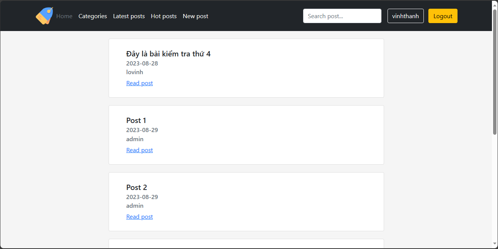
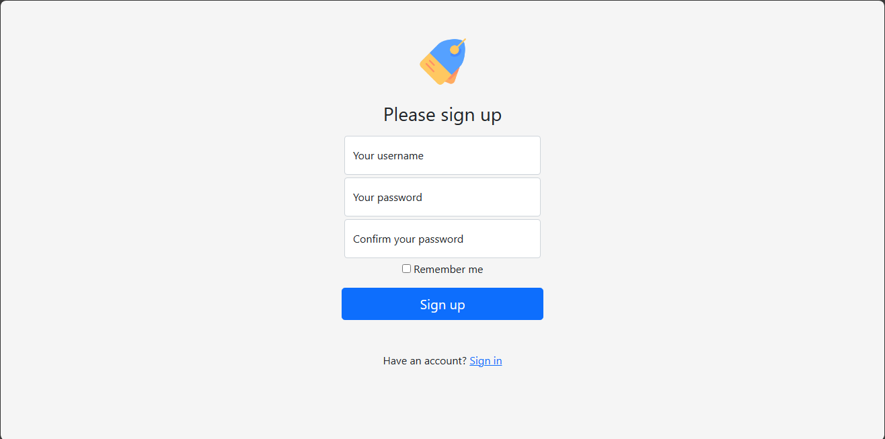
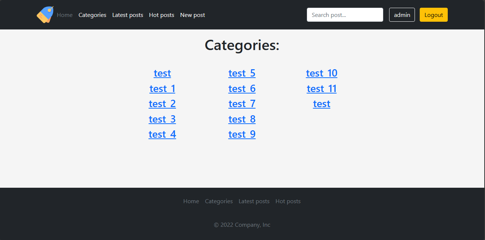
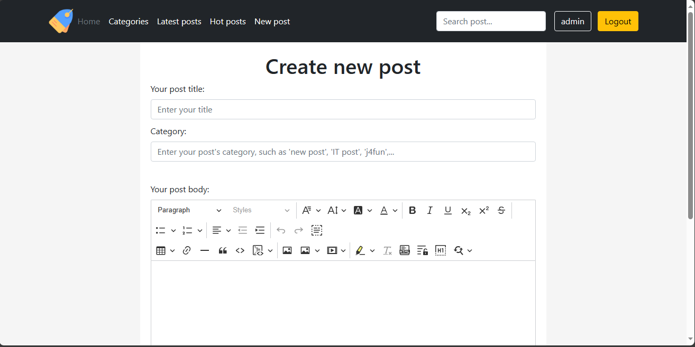

# Simple Posts Website

## Main Idea

In this project, I created a simple website that allow the users to post their posts, edit or delete them. Users can also visit other user posts, leave a comments on this post, and vote the post. This website also content some function such as sort by category, sort by latest post, and sort by hot post.

## Used Technologies

- **Bront-end**: HTML, CSS, JS, Bootstrap 5. I used a free template for the header, footer, login page and logout page on official bootstrap library website. For the editor, I used a text editor support by CKEditor - that powerful. The website is completly responsive.
- **Back-end**: PHP.

## Website demo:

I have some demo picture of my simple website:

This is a index page

This is a sign up page

This is a categories page

This is a new post page

This is a edit page
